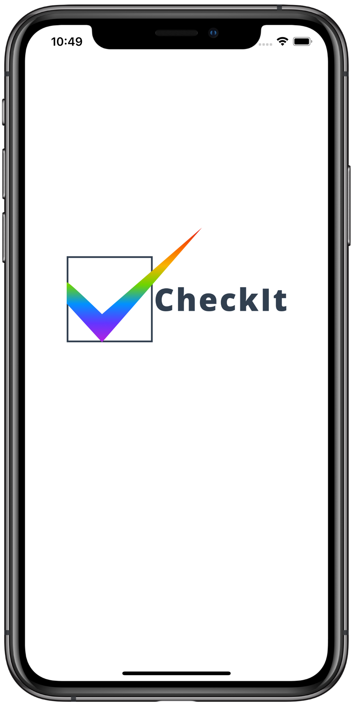
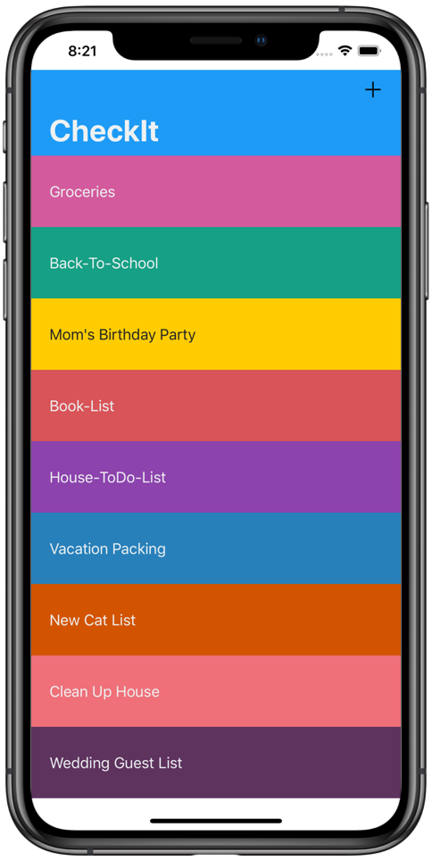
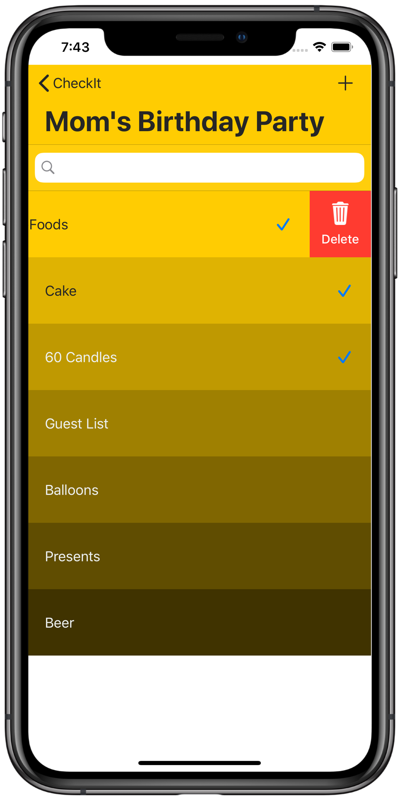

#  CheckIt

&nbsp;&nbsp;&nbsp;&nbsp;&nbsp;&nbsp;&nbsp;&nbsp;&nbsp;&nbsp;

### Author
Taylor Patterson

### Description
CheckIt is a todo iOS application where the user can create lists and those lists are color coded by gradient colors.

### Tools Used

**ChameleonFramework** - lightweight color framework for iOS developement.  

**How I used ChameleonFramework** - I used ChameleonFramework's ability to take TableView cells and render them in various colors.  I then used ChameleonFramework's amazing ability to take a cell's color and render the cell's color variants to it's darkest color depending on the length of the list associated with the cell.

For more info On **ChameleonFramework** click [here](https://cocoapods.org/pods/ChameleonFramework)

**Realm** - is a super fast mobile database alternative to CoreData.  

**How I used Realm** -  I used Realm to create a database to save the user's lists and list items.  With Realm, users can create new lists and list items as well as deleting lists and its items.  Although this database could have been created with CoreData, I learned how to use Realm to further my understanding of mobile databases.

For more info On **Realm** click [here](https://realm.io/)

**SwipeCellKit** - An easy to use Cocoapod to implement the swiping action used in the Mail app.

**How I used SwipeCellKit** - One of the advantages of standing on the shoulders of giants is taking advantage of their amazing work and using their work to make your app better.  Such is the case with my use of SwipeCellKit. Within CheckIt, I used the action provided by SwipeCellKit to give the user a familiar action used by Apple's Mail app.  This UI component allows for a shorter learning curve due to familiarity of SwipeCellKit's actions.

For more info On **SwipeCellKit** click [here](https://cocoapods.org/pods/SwipeCellKit)